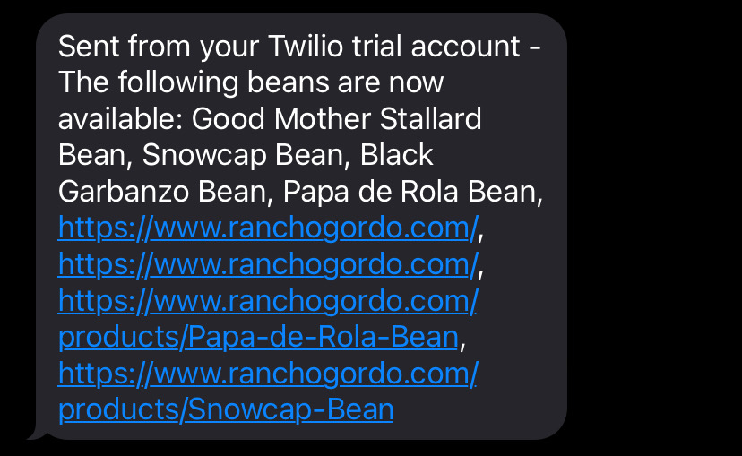

# Bean Me Up


From [Rancho Gordo](https://www.ranchogordo.com/): *"Beans are crops and sadly, we do sell out from time to time. These beans will be available again but you should click on the link and add your name to the waitlist so you'll be among the first to know when they become available."*

With Bean Me Up, you can be **the first** (nearly) to know. No email lists necessary, though I do recommend signing up for the RG one!

In a nutshell (bean-shell?), Bean Me Up does the following:
* visits the [Rancho Gordo bean waitlist](https://www.ranchogordo.com/collections/out-of-stock-beans) and scrapes the names of the waitlisted beans
* pulls down the list of yesterday's waitlisted beans from an S3 bucket
* compares the two lists, noting any beans that are now available (yay)
* texts you the results. Bean Me Up will also generate (and then test) a URL to include in the text, making those beans just a click away. If necessary, it will fall back to the generic [Rancho Gordo](https://www.ranchogordo.com/) link (naming conventions across the site aren't super consistent)
* uploads today's data to S3

## Serverless Bean Counter (AWS lambda function)
While it works great locally, this project was designed to run as a lambda function. The following is a brief overview on how to do that.

First, create an S3 bucket in AWS to hold the results of the scraping. Next, make an IAM role so your lambda function can access that S3 bucket. Select the "AWSLambdaExecute" role and name it lambda-s3-role (or whatever you want).

You'll then want convert the main function in your main.go file into a lambda function. To do this, rename the main function to HandleRequest and then add the following new function:

```
func main() {
	lambda.Start(HandleRequest)
}
```

Next, run the following two commands in your terminal (if you're on a Mac -- see [here](https://docs.aws.amazon.com/lambda/latest/dg/golang-package.html) if not):
* GOOS=linux go build main.go
* zip main.zip main

After this, create a lambda function (from scratch) in AWS, selecting the Go runtime. Under "existing role," choose the role you created a few steps ago. Select "upload from .zip" and upload your main.zip file. Within runtime settings, make sure to change the Handler name from the default "hello" to "main" (don't include parentheses). Add configurations for your environment variables (Twilio stuff and AWS stuff, and you'll need to sign up for a free Twilio account).

Finally, create a new rule (scheduled) on EventBridge to control how often you check the waitlist. I recommend every 5 minutes. Choose "lambda function" as the target and then select your lambda function. Bingo (or should I say, beango), you're done!

### Other Name Contenders
* Bean Counter (thanks Patrick!)
* What A Long, Strange Trip It's Bean
* Bean There, Scraped That
* Go Get Beans